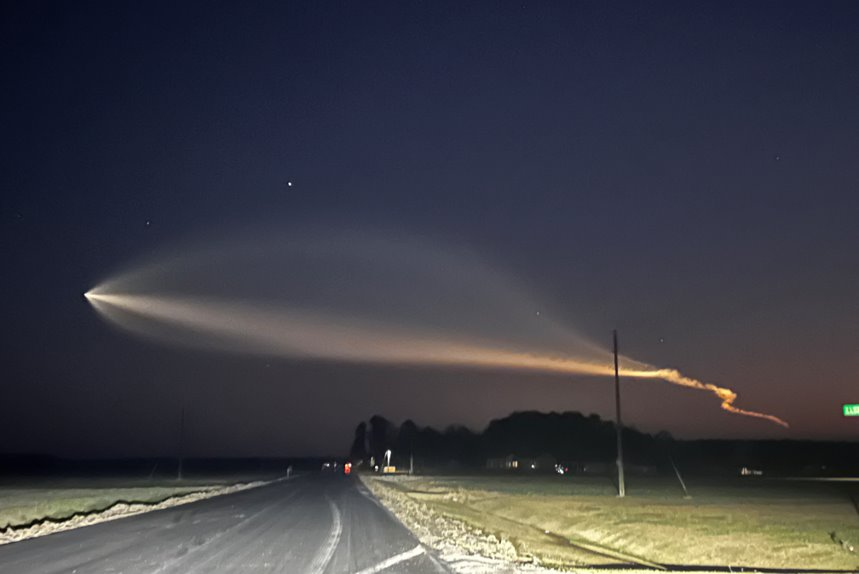

# UFO App Streamlit 

Este repositorio se basa en un ejercicio libre con prepocesamiento de datos, EDA, trabajo con modelos predictivos, App de Streamlit y todo ello sobre un conjunto de datos de avistamientos de OVNIs en el mundo.

## Conjunto de datos

Este dataset consta de 17 columnas principales, de las cuales algunas estaban dañadas y decidí repararlas de diversas formas para aplicar mis conocimientos adquiridos y otras decidí eliminarlas. También veremos como alguna columna es añadida para visualizar mejor algun dato que otro y exponerlo mediante nuevas gráficas. Dentro de dichas columnas, contamos con más de 80.000 datos, que agruparemos y expondremos graficamente los más interesantes.

## Objetivos

El principal objetivo no es otro que continuar aprendiendo y seguir cogiendo experiencia en este mundillo. Practicar con el código, ver nuevas gráficas y empezar a pensar más de vez en cuando como un analísta de datos. Dentro de este objetivo se desprenden otros más en relación con el conjunto de datos con el que trabajamos. El primero de ellos será montar un Storytelling que se basará en una expedición para el avistamiento de OVNIs y en concreto lo orientaré en España. El segundo de ellos será la creación de una APP en Streamlit con una predicción para aplicar las técnicas adquiridas de creación de modelos predictivos. 

## Resultados

Como resultado general, vemos que la mayoría de avistamientos registrados son en Estados Unidos, con un 88% sobre el resto. Que dentro de el continente europeo, Reino Unido es el más destacado con más de 2.000 avistamientos. España cuenta con 74 registrados. Dentro de lo que es nuestro país, Andalucía es la comunidad autónoma con más avistamiento registrados, con un total del 28%, dentro, se erigen Marbella y Málaga como localidades con más avistamientos registrados. Dentro del tipo de OVNI que nos podemos encontrar, el tipo de luz, es el que más hay registrado, seguido de los OVNIs triangulares y circulares. Una clara conclusión que hemos podido sacar es que el número de avistamientos registrados, va en aumento según han avanzado los años. La época del año donde más registros hay es en verano, en concreto el mes de julio y entre las 21 y las 22 horas.

## APP Streamlit

Por otro lado, dejo constancia en este enlace https://avistamiento-ovnis.streamlit.app/ el proyecto entero donde quedan reflejados estos resultados, así como más información que se puede extraer. También dejo constancia de el pequeño simulacro de modelo predictivo de la duración en segundos que puede durar un avistamiento, según las variables que elijamos.

## Código

Para ejecutar el código, primero, antes de todo, asegúrese de tener todas las dependencias instaladas.

## Contribuciones

Las contribuciones a este repositorio son bienvenidas. Asegúrese de que el código siga las mejores prácticas y esté bien documentado.

## Licencia

Este proyecto está bajo la licencia MIT.